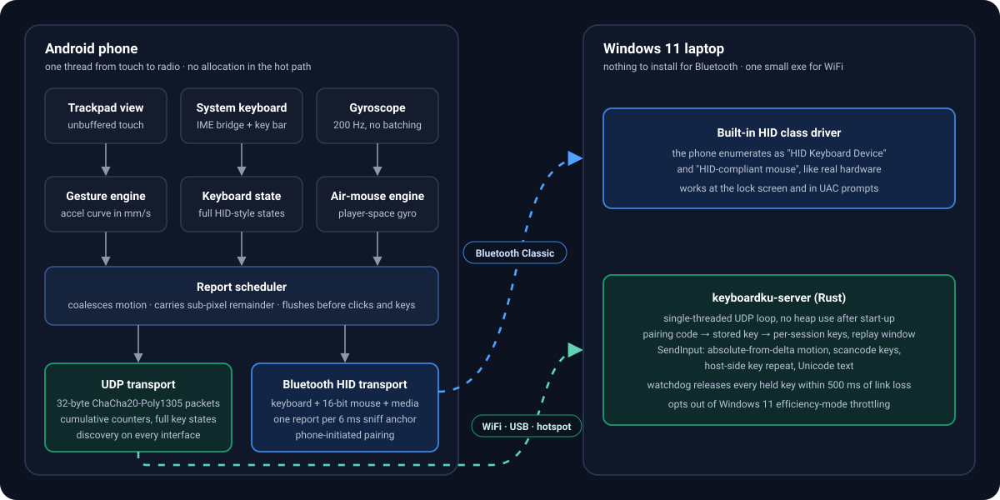
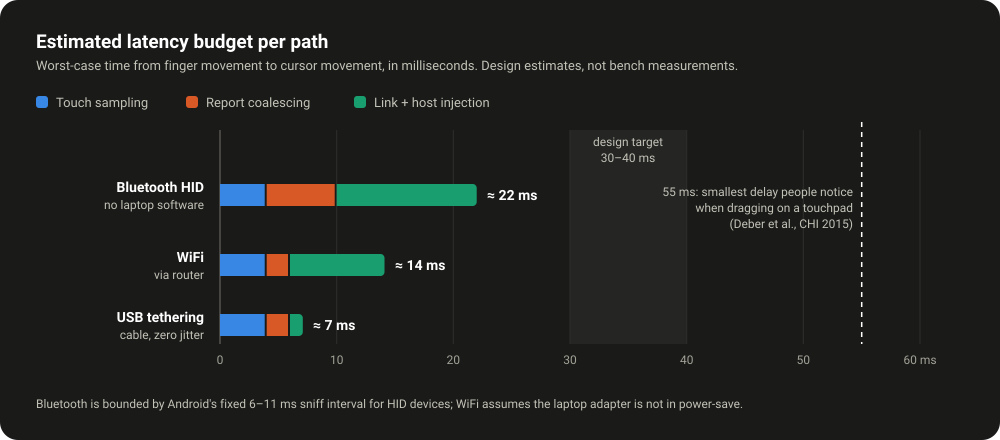
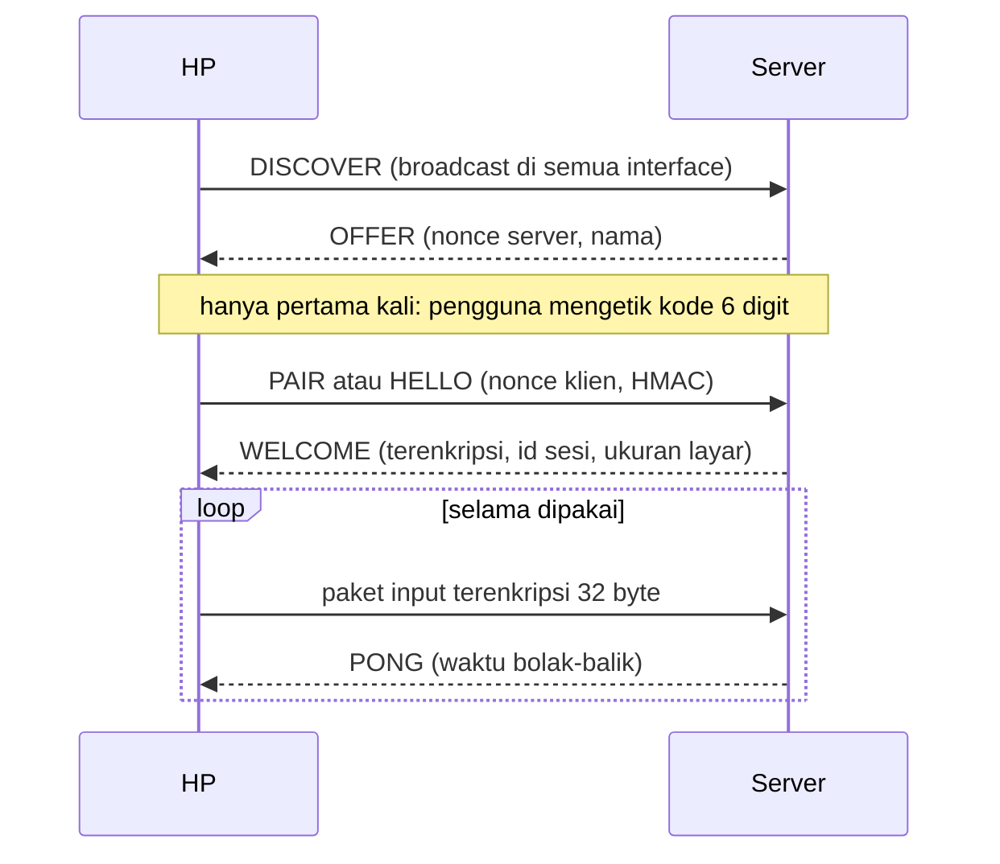

<p align="center">
  
</p>

<p align="center">
  
  
  
  
  
</p>

<p align="center">
  <a href="README.md">English</a> · <b>Bahasa Indonesia</b>
</p>

---

KeyboardKu mengubah HP Android menjadi **keyboard, trackpad, dan air-mouse gyro nirkabel** untuk laptop Windows 11. Aplikasi ini dibangun dengan tiga tujuan: latensi serendah yang dimungkinkan radio, pemakaian baterai sehemat mungkin, dan koneksi yang tidak pernah meninggalkan tombol tersangkut.

Ada dua jalur koneksi, dan aplikasi memilihkannya untuk Anda:

| | Bluetooth HID | WiFi · USB tethering · hotspot |
|---|---|---|
| **Yang dilihat laptop** | Keyboard dan mouse Bluetooth asli | Server Rust kecil yang menyuntikkan input |
| **Software di laptop** | Tidak ada | `keyboardku-server.exe` |
| **Keamanan** | Enkripsi link Bluetooth | ChaCha20-Poly1305 di setiap paket |
| **Paling cocok untuk** | Pemakaian harian, lock screen, jendela UAC | HP yang ROM-nya memblokir profil HID; latensi terendah lewat USB |

Banyak ROM Xiaomi, Oppo, Vivo, dan Realme mematikan profil HID Device milik Android. KeyboardKu mendeteksinya saat berjalan dan pindah ke WiFi dengan sendirinya.

## Keunggulan

- **Trackpad yang terasa seperti trackpad.** Tap, tap lalu geser untuk drag, dua jari untuk scroll dan klik kanan, tiga jari untuk klik tengah, serta tombol tahan untuk drag. Akselerasi pointer dihitung dari kecepatan jari dalam milimeter per detik, sehingga rasanya sama di semua kerapatan layar.
- **Keyboard pilihan Anda sendiri.** Teks berasal dari keyboard sistem, jadi swipe typing, autocorrect, dan bahasa apa pun tetap berfungsi. Bar tombol menambahkan Esc, Tab, modifier, panah, F1 sampai F12, dan tombol media. Menahan tombol menghasilkan auto-repeat di laptop.
- **Air-mouse.** Tahan satu jari di area trackpad lalu arahkan kursor dengan menggerakkan HP, seperti gyro aiming di kontroler game. Tidak ada drift saat HP diam, dan sensor tidur setelah 30 detik tidak bergerak.
- **Protokol yang menyembuhkan diri.** Gerakan mouse dikirim sebagai counter kumulatif dan tombol sebagai state penuh, sehingga paket yang hilang diperbaiki oleh paket berikutnya. Jika koneksi putus, laptop melepas semua tombol yang tertahan dalam setengah detik.
- **Hemat baterai.** Tidak ada yang dikirim saat layar tidak disentuh, layar meredup saat idle, dan kunci WiFi latensi rendah hanya dipegang selama gesture.
- **Discovery tanpa setelan.** HP mencari server di semua interface jaringan, jadi WiFi, USB tethering, dan hotspot HP langsung bekerja.

## Cara kerja

<p align="center">
  
</p>

Semua proses di HP berjalan di satu thread, dari event sentuh sampai pemanggilan radio. Tidak ada antrean dan tidak ada serah-terima antar thread, sehingga satu sumber jitter pada prosesor big.LITTLE hilang. Event sentuh diminta tanpa buffer, jadi sampel tiba secepat digitizer, bukan sekali per frame layar.

Di Bluetooth, Android menetapkan link HID pada interval sniff 6 sampai 11 ms yang tidak bisa diubah aplikasi. Karena itu penjadwal mengirim paling banyak satu laporan gerak per 6 ms dan menggabungkan sisanya ke laporan berikutnya. Di WiFi iramanya 2 ms.

## Latensi

<p align="center">
  
</p>

Angka ini adalah anggaran rancangan, bukan hasil benchmark. Targetnya 30 sampai 40 ms dari jari ke kursor, jauh di bawah 55 ms yang baru bisa dirasakan orang saat melakukan drag di touchpad. Rincian anggaran dan cara mengukurnya ada di [docs/LATENCY.md](docs/LATENCY.md).

## Tampilan aplikasi

<p align="center">
  
</p>

## Mulai cepat

### 1. Pasang aplikasi

Bangun APK bertanda tangan lalu kirim ke HP lewat cara apa pun (aplikasi chat, cloud drive, kabel). Buka filenya di HP untuk memasang. USB debugging tidak diperlukan.

```powershell
.\tools\setup-android-sdk.ps1      # sekali: memeriksa toolchain, membuat Gradle wrapper
.\tools\build-apk.ps1 -Release     # menghasilkan dist\KeyboardKu-0.1.0.apk
```

Kebutuhan di mesin build: **Android Studio** (JDK dan SDK bawaannya yang dipakai) dan, untuk server, **Rust** dengan toolchain MSVC.

### 2a. Sambung lewat Bluetooth

1. Buka aplikasi dan beri izin Bluetooth serta notifikasi. Baris status menampilkan *siap pairing* jika ROM mendukung HID.
2. Tekan **Pair**, pilih *Cari & sandingkan laptop (dari HP)*, pilih laptop, lalu setujui passkey di kedua sisi.
3. Windows kini menampilkan *HID Keyboard Device* dan *HID-compliant mouse*. HP menyambung ulang sendiri setelah laptop bangun dari tidur.

Pairing sengaja dimulai dari HP: beberapa build HyperOS menolak pairing yang dimulai dari PC.

### 2b. Sambung lewat WiFi atau USB

```powershell
.\tools\run-server.ps1             # mencetak kode pairing 6 digit
.\tools\laptop-tune.ps1            # sekali, sebagai Administrator: rule firewall + matikan power-save adapter WiFi
```

Di aplikasi tekan **Cari** lalu masukkan kodenya sekali saja. Untuk latensi terendah, nyalakan USB tethering di HP; aplikasi memilih jalur itu secara otomatis.



## Keamanan

- Setiap paket WiFi dienkripsi dan diautentikasi dengan ChaCha20-Poly1305. Kunci sesi diturunkan dari kunci pairing tersimpan lewat HKDF, dan jendela anti-replay menolak duplikat.
- Kode 6 digit dipakai sekali dan tidak pernah melintasi jaringan. Tebakan salah dibatasi lajunya, dan kode diganti setelah sepuluh kali gagal.
- Di Bluetooth berlaku enkripsi link standar hasil pairing.
- Opsi `--no-auth` hanya untuk jaringan yang dipercaya.

Format paket dijelaskan di [docs/PROTOCOL.md](docs/PROTOCOL.md).

## Struktur repo

```
android/   Aplikasi Android: Kotlin murni, tanpa AndroidX, minSdk 28
server/    Host Windows: Rust, single-thread, tanpa alokasi di loop penerima
tools/     Skrip PowerShell: cek toolchain, build, instal, logcat, tuning laptop
docs/      PROTOCOL.md · HID.md · LATENCY.md · OEM.md
```

```powershell
.\tools\build-apk.ps1 -Test        # unit test + APK debug
cargo test --manifest-path server\Cargo.toml
cargo run  --manifest-path server\Cargo.toml --bin testclient   # uji end-to-end tanpa HP
```

## Pemecahan masalah

| Gejala | Solusi |
|---|---|
| Status menampilkan *tidak didukung* | ROM memblokir profil HID Device. Pakai WiFi atau USB; tidak ada sakelar untuk mengaktifkannya. |
| Kursor tersendat setelah diam di Bluetooth | Di Device Manager, buka tab Power Management adapter Bluetooth dan hapus centang *Allow the computer to turn off this device*. Pakai WiFi 5 GHz saat memakai Bluetooth. |
| Windows tidak menampilkan perangkat HID setelah pairing | Hapus HP dari Windows, pastikan aplikasi berstatus *siap pairing*, lalu pairing ulang. Windows menyimpan service record lama. |
| Server tidak ditemukan | Profil jaringan harus Privat, access point tidak boleh mengisolasi klien, atau isi IP laptop di Pengaturan. |
| Aplikasi mati saat layar padam | Ikuti checklist di aplikasi sesuai merek HP. Rinciannya ada di [docs/OEM.md](docs/OEM.md). |
| Game mengabaikan mouse | Jalankan server dengan `--relative`. Windows menandai input suntikan sebagai sintetis, dan sebagian anti-cheat menolaknya. |

## Status proyek

Versi 0.1. Protokol, kriptografi, engine gesture, engine air-mouse, dan diff IME tercakup unit test, dan server lolos uji end-to-end di loopback. Pengujian di berbagai model HP masih berjalan, jadi laporan dari perangkat Anda sangat membantu, terutama apakah Bluetooth HID berhasil terdaftar di ROM Anda.

## Lisensi

[MIT](LICENSE)
