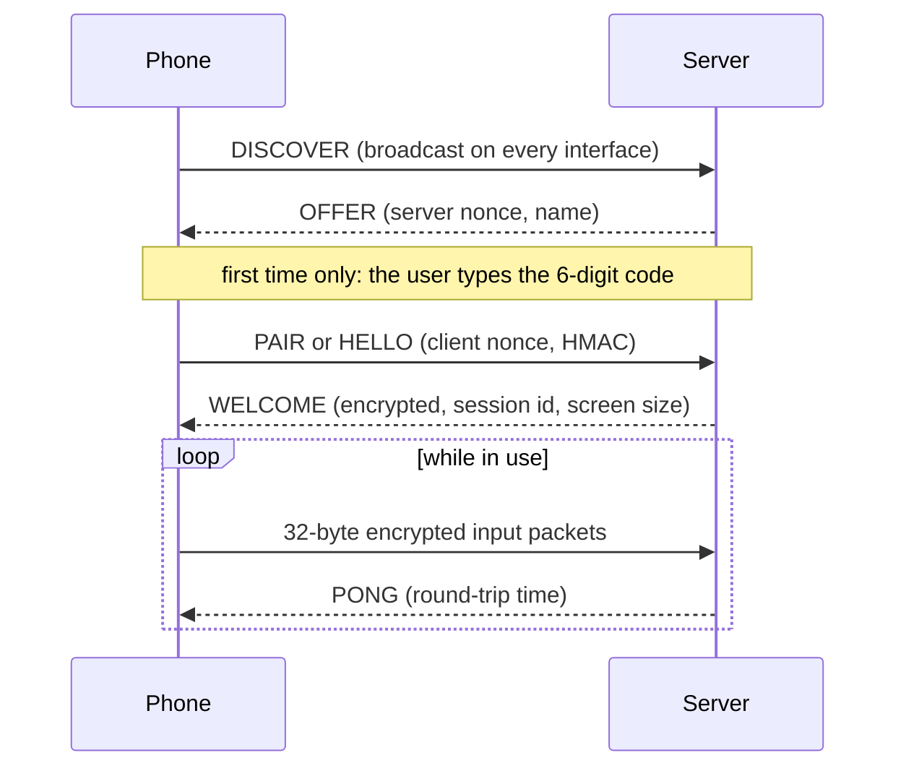

<p align="center">
  
</p>

<p align="center">
  
  
  
  
  
</p>

<p align="center">
  <b>English</b> · <a href="README.id.md">Bahasa Indonesia</a>
</p>

---

KeyboardKu turns an Android phone into a **wireless keyboard, trackpad and gyro air-mouse** for a Windows 11 laptop. It was built around three goals: the lowest latency the radios allow, as little battery as possible, and a connection that never leaves a key stuck.

It speaks two transports and picks one for you:

| | Bluetooth HID | WiFi · USB tethering · hotspot |
|---|---|---|
| **What the laptop sees** | A real Bluetooth keyboard and mouse | A small Rust server injecting input |
| **Laptop software** | None | `keyboardku-server.exe` |
| **Security** | Bluetooth link encryption | ChaCha20-Poly1305 on every packet |
| **Best for** | Everyday use, lock screen, UAC prompts | Phones whose ROM blocks the HID profile; lowest latency over USB |

Many Xiaomi, Oppo, Vivo and Realme ROMs disable Android's HID Device profile. KeyboardKu detects that at runtime and switches to WiFi by itself.

## Highlights

- **Trackpad that feels like one.** Tap, tap-and-drag, two-finger scroll and right-click, three-finger middle click, plus hold-to-drag buttons. Pointer acceleration is computed from finger speed in millimetres per second, so it behaves the same on every screen density.
- **Your own keyboard app.** Text comes from the system keyboard, so swipe typing, autocorrect and any language keep working. A key bar adds Esc, Tab, modifiers, arrows, F-keys and media keys. Holding a key auto-repeats on the laptop.
- **Air-mouse.** Rest a finger on the pad and steer the cursor by moving the phone, the way gyro aiming works on game controllers. No drift when the phone is still, and the sensor sleeps after 30 seconds of stillness.
- **Self-healing protocol.** Mouse motion travels as cumulative counters and keys as full states, so a lost packet is repaired by the next one. If the link dies, the laptop releases every held key within half a second.
- **Light on the battery.** Nothing is sent while you are not touching the screen, the display dims when idle, and the WiFi low-latency lock is held only during a gesture.
- **Discovery that just works.** The phone finds the server on every network interface, so WiFi, USB tethering and the phone's own hotspot need no setup.

## How it works

<p align="center">
  
</p>

Everything on the phone runs on one thread, from the touch event to the radio call. There is no queue and no hand-off between threads, which removes a source of jitter on big.LITTLE processors. Touch events are requested unbuffered, so samples arrive at the digitizer rate instead of once per display frame.

On Bluetooth, Android fixes the HID link at a 6 to 11 ms sniff interval that apps cannot change. The scheduler therefore sends at most one motion report per 6 ms and folds anything in between into the next report. On WiFi the cadence is 2 ms.

## Latency

<p align="center">
  
</p>

These figures are a design budget, not a benchmark. The target is 30 to 40 ms from finger to cursor, comfortably under the 55 ms that people can just notice when dragging on a touchpad. See [docs/LATENCY.md](docs/LATENCY.md) for the full budget and how to measure it on your own devices.

## The app

<p align="center">
  
</p>

## Quick start

### 1. Install the app

Build a signed APK and copy it to the phone by any means (chat app, cloud drive, cable). Open the file on the phone to install it. USB debugging is not required.

```powershell
.\tools\setup-android-sdk.ps1      # once: checks the toolchain, creates the Gradle wrapper
.\tools\build-apk.ps1 -Release     # writes dist\KeyboardKu-0.1.0.apk
```

Requirements on the build machine: **Android Studio** (its bundled JDK and SDK are used) and, for the server, **Rust** with the MSVC toolchain.

### 2a. Connect over Bluetooth

The app interface is currently in Indonesian, so labels are quoted as they appear on screen.

1. Open the app and grant the Bluetooth and notification permissions. The status line shows *siap pairing* (ready to pair) when the ROM supports HID.
2. Tap **Pair**, choose *Cari & sandingkan laptop (dari HP)* (find and pair from the phone), pick the laptop and confirm the passkey on both sides.
3. Windows now lists an *HID Keyboard Device* and an *HID-compliant mouse*. The phone reconnects by itself after the laptop sleeps.

Pairing from the phone is deliberate: some HyperOS builds reject pairing that the PC starts.

### 2b. Connect over WiFi or USB

```powershell
.\tools\run-server.ps1             # prints a 6-digit pairing code
.\tools\laptop-tune.ps1            # once, as Administrator: firewall rule + WiFi adapter power-save off
```

In the app tap **Cari** (search) and enter the code once. For the lowest latency, enable USB tethering on the phone; the app picks that path automatically.



## Security

- Every WiFi packet is encrypted and authenticated with ChaCha20-Poly1305. Session keys come from a stored pairing key via HKDF, and a replay window rejects duplicates.
- The 6-digit code is used once and never crosses the network. Wrong guesses are rate-limited and the code rotates after ten failures.
- Over Bluetooth the standard link encryption of the pairing applies.
- `--no-auth` exists for trusted networks only.

The packet format is specified in [docs/PROTOCOL.md](docs/PROTOCOL.md).

## Repository layout

```
android/   Android app: plain Kotlin, no AndroidX, minSdk 28
server/    Windows host: Rust, single-threaded, no allocation in the receive loop
tools/     PowerShell helpers: toolchain check, build, install, logcat, laptop tuning
docs/      PROTOCOL.md · HID.md · LATENCY.md · OEM.md
```

```powershell
.\tools\build-apk.ps1 -Test        # unit tests + debug APK
cargo test --manifest-path server\Cargo.toml
cargo run  --manifest-path server\Cargo.toml --bin testclient   # end-to-end check without a phone
```

## Troubleshooting

| Symptom | Fix |
|---|---|
| Status shows *tidak didukung* (unsupported) | The ROM blocks the HID Device profile. Use WiFi or USB; there is no runtime switch for it. |
| Cursor stutters after idle on Bluetooth | In Device Manager, open the Bluetooth adapter's Power Management tab and untick *Allow the computer to turn off this device*. Prefer 5 GHz WiFi while using Bluetooth. |
| Windows shows no HID device after pairing | Remove the phone in Windows, make sure the app says *siap pairing*, then pair again. Windows caches the old service record. |
| Server not found | The network profile must be Private, the access point must not isolate clients, or enter the laptop's IP in Settings. |
| App dies when the screen turns off | Follow the in-app checklist for your brand. Details in [docs/OEM.md](docs/OEM.md). |
| Games ignore the mouse | Start the server with `--relative`. Windows marks injected input as synthetic, which some anti-cheat systems reject. |

## Project status

Version 0.1. The protocol, cryptography, gesture engine, air-mouse engine and IME diff are covered by unit tests, and the server passes an end-to-end loopback test. Testing across phone models is ongoing, so reports from your device are welcome, especially whether Bluetooth HID registers on your ROM.

## License

[MIT](LICENSE)
